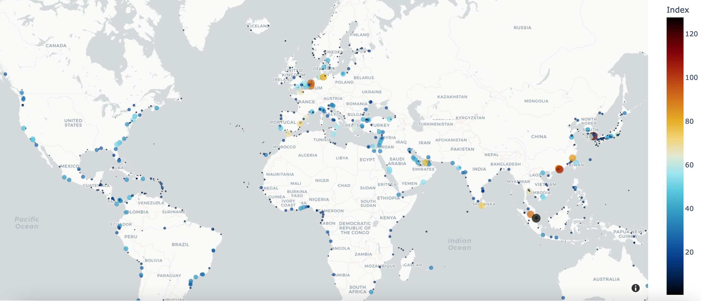

# Maritime Shipping and Ports Visualization

In maritime sector there are so many measures to describe a country's integration into global shipping network, as well performance across different ports.

This project is about creating several visualization related to some shipping and port activity indicators such as port calls, Liner Shipping Connectivity Index (LSCI), Port Liner Shipping Connectivity Index (PLSCI), and Container port throughput.

### Notebook Content
    Imports
    Setup
    Utility functions
    1 Port Calls
        1 Top 20 countries by number of port calls
        2 Number of port calls per country distribution
    2 Liner Shipping Connectivity Index (LSCI)
        1 LSCI and number of port calls by country
        2 LSCI histogram
        3 Top 10 countries by LSCI over the last decade
        4 LSCI of some countries over the last decade
    3 Port Liner Shipping Connectivity Index (PLSCI)
    4 Container Ports
        1 Throughput
        2 Median time in port
        3 Port flow
    References

